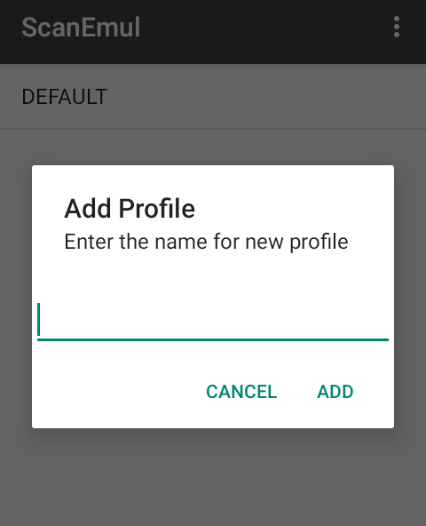
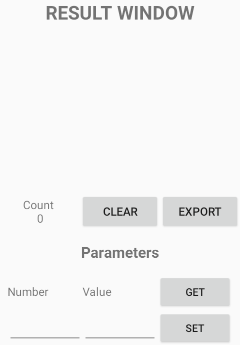
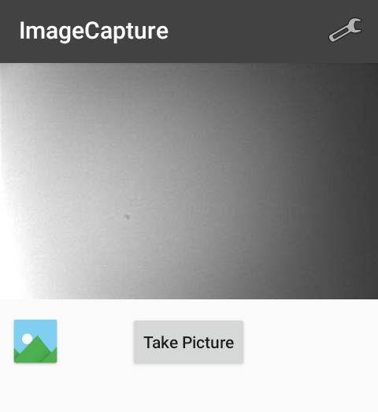
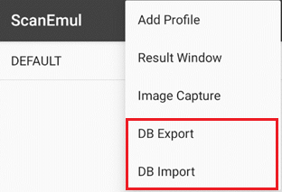

## 메인 화면

### Profile

<div className="manualMediaRow">
<div className="manualMediaRowText">

Profile을 편집할 수 있습니다. <br/>DEFAULT Profile은 기본으로 생성되어 있으며 삭제할 수 없고, 다른 Profile의 Associated Apps에 등록된 항목 이외의 응용프로그램에서 적용되는 설정입니다.

</div>
<div className="manualMediaRowImage">


</div>
</div>

---

## Option Menu

<div className="manualMediaRow">
<div className="manualMediaRowText">

### Add Profile
Profile을 추가합니다. <br/>
```
❗ Profile 명으로 DEFAULT를 지정할 수 없습니다.
```

</div>
<div className="manualMediaRowImage">



</div>
</div>

<div className="manualMediaRow">
<div className="manualMediaRowText">

### Result Window
바코드의 디코딩을 통해 바코드의 유형과 데이터를 확인할 수 있습니다. Default Profile의 설정을 따릅니다.

각 버튼의 동작은 다음과 같습니다:
- **`CLEAR`** : 출력 결과를 초기화합니다.
- **`EXPORT`** : ?
- **`GET`** : ??
- **`SET`** : ???

</div>
<div className="manualMediaRowImage">



</div>
</div>

<div className="manualMediaRow">
<div className="manualMediaRowText">

### Image Capture
스캐너 모듈을 활용하여 프리뷰를 출력하고, 사진을 찍을 수 있습니다. <br/>
우측 상단 아이콘을 통해 **Image Capture** 설정을 제어할 수 있습니다. <br/>
**Image Capture** 설정에 대한 자세한 내용은 [**Image capture params**](./zebra-2d/scanner-settings/image-capture-params) 항목을 참고해주세요.

</div>
<div className="manualMediaRowImage">



</div>
</div>

<div className="manualMediaRow">
<div className="manualMediaRowText">

### DB Export/Import
ScanEmul의 Profile은 데이터베이스 파일(scanemul.db)로 관리됩니다. <br/> 
데이터베이스 파일 저장 경로는 **`/Android/data/net.m3mobile.app.scanemul/scanemul.db`** 입니다.

이때 DB Import를 통해 데이터베이스 파일을 가져오거나, DB Export를 통해 데이터베이스 파일을 내보낼 수 있습니다.<br/>
데이터베이스 파일명은 **`scanemul.db`** 입니다.

</div>
<div className="manualMediaRowImage">



</div>
</div>

```
❗ 가져온 데이터베이스 설정을 적용하기 위해선 단말기를 재부팅 해야 합니다.
```
