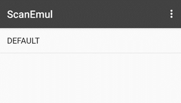
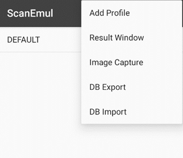

import ManualEntry from '@site/src/components/ManualEntry';

## 개요
ScanEmul 앱은 고객 업무 프로그램과 쉽게 통합할 수 있도록 인텐트 제어 기능을 제공하며 스캔 디코딩 테스트 결과 화면을 지원합니다. 또한 고객은 Profile을 생성하거나 편집하여 스캐너 설정을 작업 환경에 맞도록 변경하고 관리할 수 있습니다

## 메인 화면

### Profile

ScanEmul의 설정은 Profile로 관리됩니다.  
Profile에 대한 자세한 내용은 [**Profile**](./basic-usage/#profile) 항목을 참고해주세요.

---

## Option Menu

### Add Profile
Profile을 추가합니다.  
자세한 내용은 [**Add Profile**](./basic-usage/#add-profile) 항목을 참고해주세요.

### Result Window
바코드의 디코딩을 통해 바코드의 유형과 데이터를 확인할 수 있습니다.  
자세한 내용은 [**Result Window**](./basic-usage/#result-window) 항목을 참고해주세요.

### Image Capture
스캐너 모듈을 활용하여 프리뷰를 출력하고, 사진을 찍을 수 있습니다. 
자세한 내용은 [**Image Capture**](./basic-usage/#image-capture) 항목을 참고해주세요.

### DB Export/Import
ScanEmul의 데이터베이스 파일을 가져오거나 내보냅니다. 
자세한 내용은 [**DB Export/Import**](./basic-usage/#db-export/import) 항목을 참고해주세요.

**상세 기능은 스캐너마다 다를 수 있습니다. 자세한 내용은 아래 문서를 참고해주세요.**

<ManualEntry group="apps" id="scanemul" showLinkedDocs={false} />
