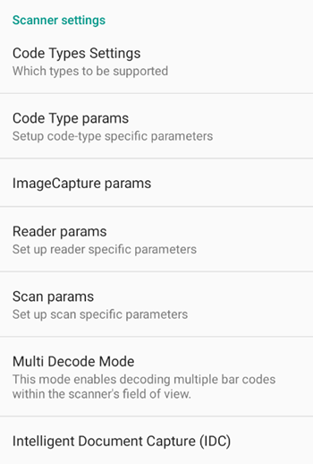
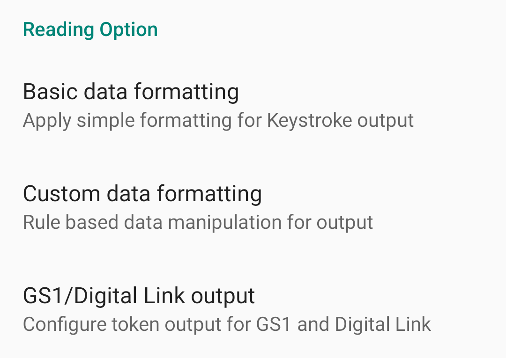
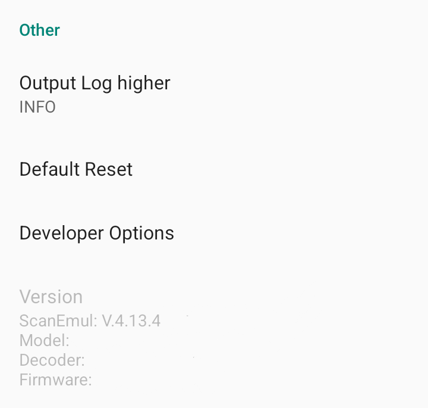

## Scanner Settings

### Code type settings
디코딩할 수 있는 바코드의 유형을 설정합니다. 
자세한 내용은 [**Code type settings**](./scanner-settings/code-type-settings) 항목을 참고해주세요.

### Code type params
각 바코드 유형의 세부 설정입니다.  
자세한 내용은 [**Code type params**](./scanner-settings/code-type-params) 항목을 참고해주세요.

### Image capture params
이미지 캡쳐 설정입니다.  
자세한 내용은 [**Image capture params**](./scanner-settings/image-capture-params) 항목을 참고해주세요.

### Reader params
디코딩 조건을 설정합니다.  
자세한 내용은 [**Reader params**](./scanner-settings/reader-params) 항목을 참고해주세요.

### Scan params
디코딩 데이터의 코드 ID와 디코딩 완료 알림 설정을 지정할 수 있습니다. 
자세한 내용은 [**Scan params**](./scanner-settings/scan-params) 항목을 참고해주세요.

### Multi decode mode
중복되지 않는 여러 개의 바코드를 동시에 스캔할 수 있도록 설정합니다. 
자세한 내용은 [**Multi decode mode**](./scanner-settings/multi-decode-mode) 항목을 참고해주세요.

### Intelligent Document Capture (IDC)
바코드가 포함된 문서를 촬영하는 기능을 설정합니다. 
자세한 내용은 [**Intelligent Document Capture (IDC)**](./scanner-settings/intelligent-document-capture) 항목을 참고해주세요.

---

## Reading Options

### Basic data formatting
기본적인 출력 형식을 설정합니다.  
자세한 내용은 [**Basic data formatting**](./reading-options/basic-data-formatting) 항목을 참고해주세요.

### Custom data formatting
문자 규칙을 설정하여 디코딩 데이터를 출력할 수 있습니다.  
자세한 내용은 [**Custom data formatting**](./reading-options/custom-data-formatting) 항목을 참고해주세요.

### GS1/Digital link output
GS1/Digital Link 출력 결과 처리 방법을 설정합니다.  
자세한 내용은 [**GS1/Digital link output**](./reading-options/gs1-digital-link-output) 항목을 참고해주세요.

---

## Others

### Output log higher
Logcat에 출력될 로그의 레벨을 조정합니다.  
자세한 내용은 [**Output log higher**](./others/output-log-higher) 항목을 참고해주세요.

### Default reset
모든 설정을 초기화합니다.  
자세한 내용은 [**Default reset**](./others/default-reset) 항목을 참고해주세요.

### Developer options
ScanEmul을 통해 이용할 수 있는 개발자 옵션을 설정할 수 있습니다.  
자세한 내용은 [**Developer options**](./others/developer-options) 항목을 참고해주세요.

