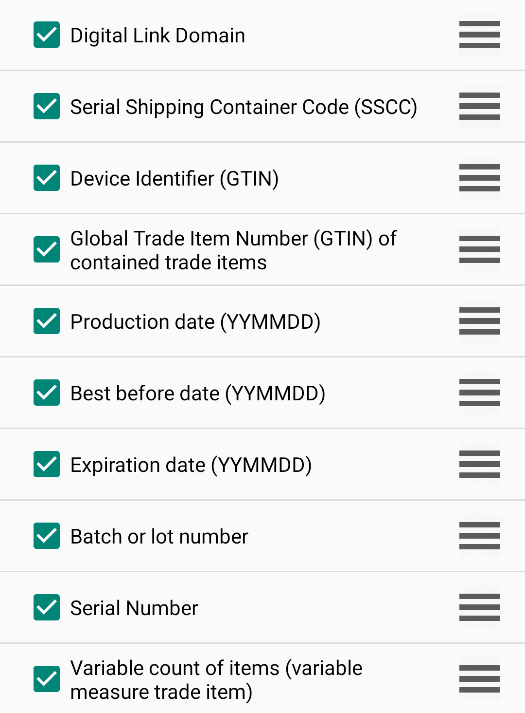

## 개요
GS1/Digital Link 출력 결과 처리 방법을 설정합니다.

## Barcode parsing
결과 파싱 활성화 여부를 설정합니다.

### Enable GS1 parsing
GS1 파싱을 활성화 또는 비활성화합니다.

### Enable Digital Link parsing
Digital Link 파싱을 활성화 또는 비활성화합니다.

<Image src="../../images/zebra2d/gs1-barcode-parsing.png" />

---

## GS1/Digital Link specific
GS1/Digital Link 출력을 상세히 설정합니다.

### Send tokens
파싱된 GS1/Digital Link 데이터의 출력 방식을 설정할 수 있습니다.
- `Disabled` : 읽은 결과만 출력합니다.
- `Tokens only` : 파싱된 토큰만 출력합니다.
- `Barcodes and tokens` : 읽은 결과와 파싱된 토큰을 모두 출력합니다.

### Token seperator
출력 토큰 사이의 구분자를 설정합니다.

구분자 목록 : `None`/`Tab`/`Line feed`/`Carriage return`

<Image src="../../images/zebra2d/gs1-specific.png" />

### Token order
각 토큰을 활성화하거나 비활성화할 수 있으며, 드래그하여 출력 순서를 변경할 수 있습니다.

**지원되는 AI (Application Identifier) 목록은 다음과 같습니다:**

- **`N/A`**: Digital Link Domain
- **`00`**: Serial Shipping Container Code (SSCC)
- **`01`**: Device Identifier (GTIN)
- **`02`**: Global Trade Item Number (GTIN) of contained trade items
- **`11`**: Production date (YYMMDD)
- **`15`**: Best before date (YYMMDD)
- **`17`**: Expiration date (YYMMDD)
- **`10`**: Batch or lot number
- **`21`**: Serial Number
- **`30`**: Variable count of items (variable measure trade item)
- **`37`**: Count of trade items or trade item pieces contained in a logistic unit
- **`91`**: Company internal information
- **`400`**: Customer purchase order number
- **`420`**: Ship to / Deliver to postal code within a single postal authority

